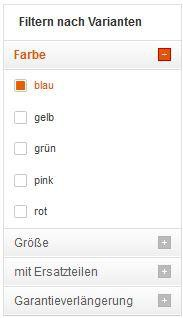
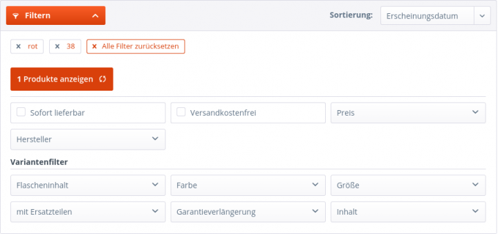

# SwagVariantFilter

## Description
This plugin automatically reads every item variation and group of variants of a defined category. 
This information can be used for category listings as an additional filter (i.e. "Size"). 
The customer can filter for specific variants in the frontend.
Please note that this plugin offers an independent filter function for variants and is not combined with the existing features/filters!

## Images

## License

The MIT License (MIT). Please see [License File](LICENSE) for more information.
